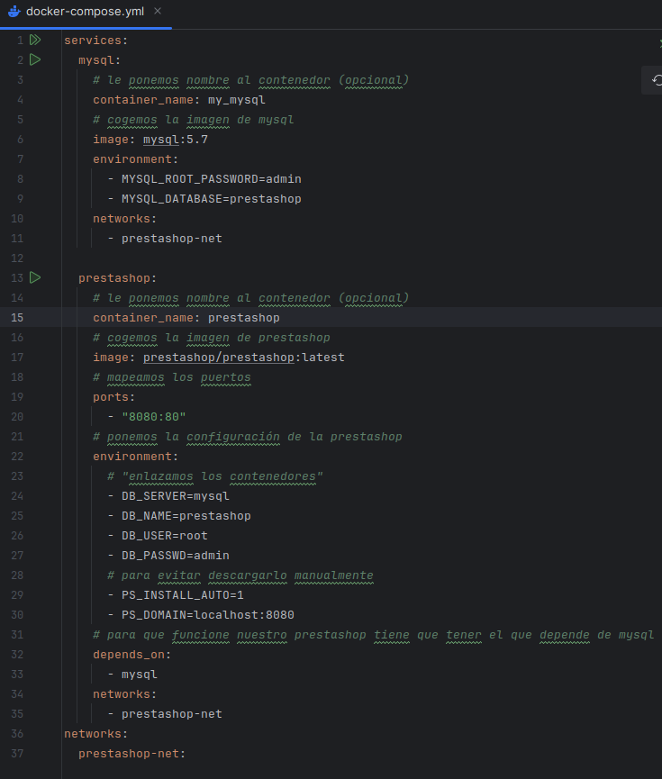
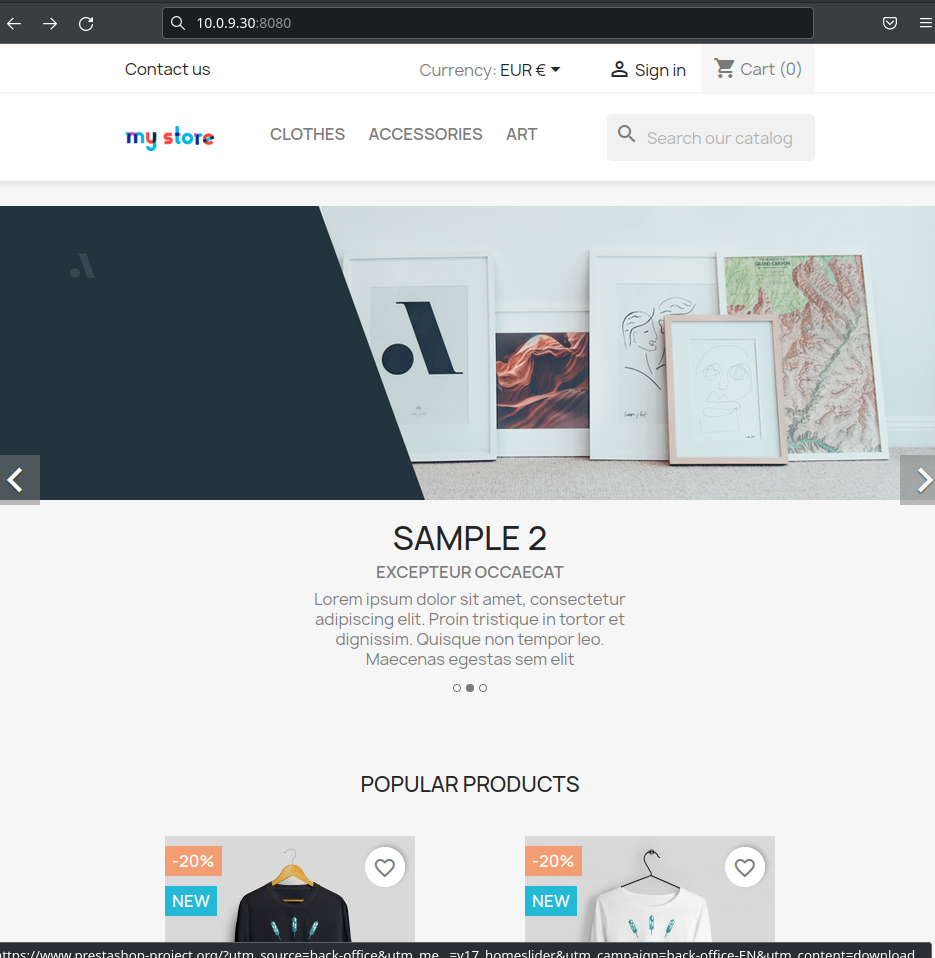
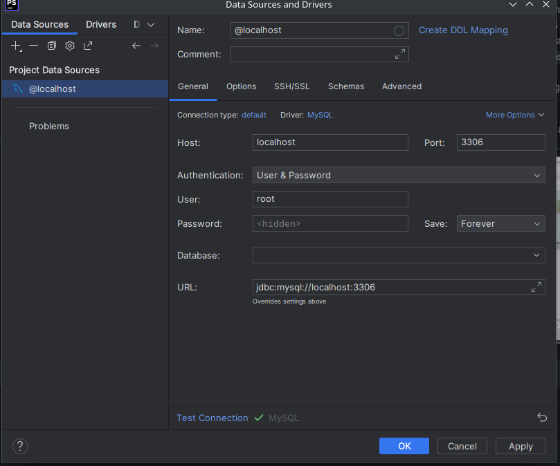
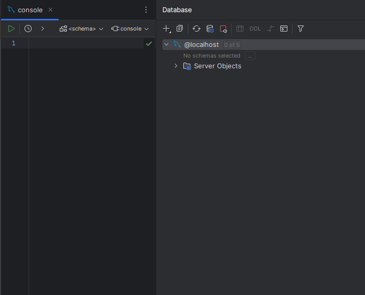

# PrestaShop
Para poder levantar nuestra prestashop necesitaremos usar dos contenedores, uno con una base de datos, en mi caso mysql y otro con el de prestashop.

1. Lo primero que tenemos que hacer es declarar en el docker-compose.yml la palabra `services`
2. Ahora empezaremos con los contenedores, empezaremos con la base de datos:
   + Pondremos el nombre del servidor del servicio: `mysql`
   + (Opcional) cambiarle el nombre del contenedor: `container_name: my_mysql`
   + Tenemos que definir la imagen del servidor: `image: mysql:5.7`
   + Cambiamos la configuración del servicio: `environment:`
     `- MYSQL_ROOT_PASSWORD=admin` para cambiar la contraseña del usuario root,
     `- MYSQL_DATABASE=prestashop` para cambiar el nombre de la base de datos
   + Ahora tenemos que definir nuestra red personalizada: `networks:` y ponemos el nombre `- prestahop-net`

    
   
3. Ahora que tenemos la de bases de datos, nos toca hacer el contenedor de la prestahop, como es practicamente igual que el anterior solo explicaré lo que hay diferente:
   + Tenemos que mapearle los puertos: `ports:` y ahora el mapeo: `- "8080:80"` siendo el primer numero el puerto de la maquina y el numero despues de los : el puerto del contenedor
   + En la configuracion de la prestashop (_environment_):
     + Para enlazar este contenedor con la base de datos: `- DB_SERVER=mysql`
     + Poner el nombre de la base de datos a la que se conectara prestashop: `- DB_NAME=prestashop`
     + Poner el nombre de usuario que usara prestashop para conectarse a la base de datos
     + Poner la contraseña que usara para conectarse a la base de datos: `- DB_PASSWD=admin`
     + Si queremos evitarnos descargar las cosas manualmente podemos usar la siguiente configuracion
       + `- PS_INSTALL_AUTO=1`
       + `- PS_DOMAIN=localhost:8080`
   + Nuestra prestashop depende de la base de datos así que hay que expecificarlo: `depends_on:` `- mysql`

 

4. Y por último, ahora que tenemos los contenedores creados, tenemos que volver a definir nuestra red personalizada, se define de la misma manera que en los [contenedores](#enlace)

 

5. Ahora que ya está hecho solo nos faltaría iniciar los contenedores y entrar desde el navegador haber si está bien
    + Para iniciarlos: `docker compose up -d`
    + Para entrar desde el navegador: `localhost:8080`

    
Y si todo está bien tendria que salir algo así:

Para comprobar que funciona la base de datos tenemos que darle a crear la base de datos y darle a mysql y rellenar los campos:

